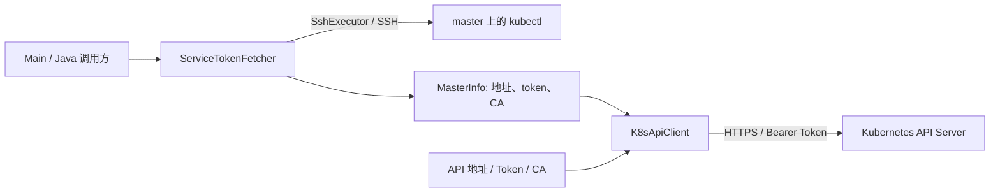

# k8s-tools

一个兼容 Java 8 的 Kubernetes 工具库，提供通用资源增删查改 API，并保留通过命令行查询集群的入口。

通过 SSH 登录控制平面节点（master），创建或复用 ServiceAccount、读取 Secret 中的 token、发现 API Server 地址并获取 CA；随后使用 Bearer Token 调用 Kubernetes API。Java 库支持内置资源和 CRD 的通用 REST 操作、选择器、分页、Patch、Apply 和子资源；CLI 查询版本、Node、Namespace、Pod、Service 和 Deployment。已有 API 凭据时可直接调用 Java API，无需 SSH。

**SSH 凭据初始化会修改资源**：默认使用 `kube-system/k8s-tools` ServiceAccount，并创建指向 `cluster-admin` 的 ClusterRoleBinding；已有 ServiceAccount 无法读取 token 时，默认删除后重建。读取请求的 TLS 校验失败时默认自动降级。接入前请阅读[默认行为与配置](#默认行为与配置)及[真实集群接入限制](#真实集群接入限制)。

## 项目结构与调用链



| 位置 | 职责 |
| --- | --- |
| [Main.java](src/main/java/com/iskycc/k8s/Main.java) | 解析命令行参数，依次获取凭据、构建客户端、打印资源摘要 |
| [ssh/](src/main/java/com/iskycc/k8s/ssh/) | `SshConfig` 配置连接；`SshExecutor` 执行远程命令；`ServiceTokenFetcher` 编排凭据获取；`MasterInfo` 保存结果 |
| [api/K8sApiClient.java](src/main/java/com/iskycc/k8s/api/K8sApiClient.java) | 公共入口、HTTP 请求、认证、TLS、Discovery 和兼容的 POJO 查询 |
| [api/K8sResourceClient.java](src/main/java/com/iskycc/k8s/api/K8sResourceClient.java) | 完整 JSON 资源 CRUD、分页、Patch/Apply、删除参数和子资源 |
| [api/model/](src/main/java/com/iskycc/k8s/api/model/) | Gson 映射的资源模型，只包含当前查询所需的部分字段 |
| [K8sToolsException.java](src/main/java/com/iskycc/k8s/K8sToolsException.java) | 统一运行时异常；`K8sApiException` 额外提供 HTTP 状态码与响应体 |
| [src/test/java/](src/test/java/) | JUnit 4 单元测试、模拟 SSH/HTTPS 服务及端到端测试 |
| [pom.xml](pom.xml) | 单模块 Maven 构建、依赖与插件配置 |
| [AGENTS.md](AGENTS.md) | 仓库维护和编码协作指南 |

主要依赖为 Apache MINA SSHD（SSH）、Apache HttpClient 5（HTTP/PATCH）和 Gson（JSON）；CLI 使用 SLF4J NOP，NOP 声明为 optional，不强制传递给库的使用者。JUnit 4、Bouncy Castle 仅用于测试。版本以 `pom.xml` 为准。

项目采用 [Apache License 2.0](LICENSE)。

## Maven Central 与持续集成

[Maven CI](.github/workflows/ci.yml) 在 `main` 提交和 PR 上使用 Java 8、21 构建并运行测试。[发布流水线](.github/workflows/publish.yml) 在正式 GitHub Release 发布后，将项目 jar、源码、Javadoc、POM 和 GPG 签名上传到 Central Portal，上传成功后结束；后续校验和正式发布由 Central 自动处理。Actions 成功不表示产物已可下载，最终状态见 Portal 的 Deployments。

首次使用需要确认 Central Portal 中的 `io.github.iskycc` 命名空间已验证，并配置 Central Portal token 与 GPG 密钥。配置步骤、Secrets 名称、版本规则和本地验证命令见 [Maven Central 发布指南](docs/publishing.md)。

**`1.1.0` 正式版已发布，包含通用资源 CRUD API。** 完整公共方法和示例见 [Java API 指南](docs/library-api.md)，核对结果见 [工具库完整性核对](docs/api-completeness.md)。当前源码的开发构建版本仍为 `1.1.0-SNAPSHOT`，快照使用方式见[快照仓库配置](docs/publishing.md#发布与使用快照)。

其他 Maven 项目可直接从 [Maven Central](https://repo1.maven.org/maven2/io/github/iskycc/k8s-tools/1.1.0/) 引用以下依赖，无需添加额外仓库。旧版 `1.0.0` 只提供查询接口。

```xml
<dependency>
  <groupId>io.github.iskycc</groupId>
  <artifactId>k8s-tools</artifactId>
  <version>1.1.0</version>
</dependency>
```

## 环境与构建

- JDK 8+，编译目标由 `maven.compiler.release=8` 指定；已在 JDK 8、21 上验证构建与测试。
- Maven 3.6.3+；仓库未提供 Maven Wrapper。
- 测试会在 `127.0.0.1` 上启动随机端口的 SSH 和 HTTPS 服务，无需真实 Kubernetes、Docker 或本地 `kubectl`。首次构建需要下载 Maven 依赖。

在仓库根目录运行：

```bash
# 编译并运行全部单元测试和模拟端到端测试
mvn test

# 构建应用 jar（包含测试），同时复制运行时依赖
mvn -B package dependency:copy-dependencies -DincludeScope=runtime

# 检查命令行入口，不连接集群
java -cp 'target/k8s-tools-1.1.0-SNAPSHOT.jar:target/dependency/*' \
  com.iskycc.k8s.Main --help
```

产物为 `target/k8s-tools-1.1.0-SNAPSHOT.jar`，运行时依赖位于 `target/dependency/`。应用 jar 不包含依赖，使用上面的 `-cp` 方式启动；仅执行 `java -jar` 无法完成业务流程。Windows 下将 classpath 分隔符 `:` 改为 `;`，并使用双引号包裹 classpath。

## 命令行使用

### 接入条件

1. 运行工具的机器能够连接目标 SSH 端口，也能够直接访问 API Server。工具不会建立 SSH 隧道；自动发现的集群内网地址未必能从本机访问，可用 `--api-server` 覆盖。
2. 远端 SSH 用户的非交互 shell 能执行 `kubectl`、`awk` 和 `cat`。`kubectl` 当前配置需要具备管理 ServiceAccount、Secret、ClusterRoleBinding 及授予目标角色的权限。
3. 默认尝试读取远端 `/etc/kubernetes/pki/ca.crt`；API 地址发现失败时会读取 `/etc/kubernetes/admin.conf`。后者仅用于提取地址，**不会**自动作为所有 `kubectl` 命令的 `--kubeconfig`。
4. 新建 token Secret 会携带必需的 SA 注解并等待控制器填充；也可预先准备资源供工具复用。环境要求与验证边界见[真实集群接入限制](#真实集群接入限制)。

### 运行示例

```bash
java -cp 'target/k8s-tools-1.1.0-SNAPSHOT.jar:target/dependency/*' \
  com.iskycc.k8s.Main \
  --host 192.0.2.10 --user root --key "$HOME/.ssh/id_rsa" \
  --namespace default
```

示例地址需替换为实际 master 地址。密码认证时，将 `--key "$HOME/.ssh/id_rsa"` 替换为 `--password '<SSH密码>'`。程序依次输出集群版本、节点、命名空间，以及所选命名空间下的 Pod、Service、Deployment 摘要。

| 参数 | 默认值 | 含义 |
| --- | --- | --- |
| `--host <host>` | 必填 | SSH 主机地址 |
| `--port <n>` | `22` | SSH 端口 |
| `--user <user>` | `root` | SSH 用户 |
| `--password <password>` | 无 | SSH 密码，与 `--key` 二选一 |
| `--key <path>` | 无 | 本地私钥路径；同时提供密码时，CLI 优先使用私钥 |
| `--namespace <ns>` | `default` | Pod、Service、Deployment 的查询范围；`all` 表示所有命名空间 |
| `--api-server <url>` | 自动发现 | 覆盖 API Server 地址，例如 `https://192.0.2.10:6443` |
| `--insecure` | 未显式开启 | 直接跳过证书和主机名校验；未传此项时仍默认允许 TLS 自动降级 |
| `-h` / `--help` | — | 打印帮助并退出 |

`--namespace` 不改变凭据所用 ServiceAccount 的命名空间，后者默认始终为 `kube-system`。CLI 没有配置 SA/RBAC、关闭自动重建、关闭 TLS 自动降级或传入私钥口令的参数，这些设置需通过 Java API 完成。

## Java 库用法

以下代码片段展示默认获取流程，前提同上：

```java
import com.iskycc.k8s.api.K8sApiClient;
import com.iskycc.k8s.ssh.MasterInfo;
import com.iskycc.k8s.ssh.ServiceTokenFetcher;
import com.iskycc.k8s.ssh.SshConfig;

SshConfig ssh = SshConfig.builder()
        .host("192.0.2.10")
        .username("root")
        .privateKeyPath(System.getProperty("user.home") + "/.ssh/id_rsa")
        .build();

MasterInfo info = new ServiceTokenFetcher(ssh).fetch();
K8sApiClient client = K8sApiClient.fromMasterInfo(info);

System.out.println(client.getVersion().getGitVersion());
client.listNodes().forEach(System.out::println);
client.listNamespaces().forEach(System.out::println);
client.listPods("default").forEach(System.out::println);
client.listServices("default").forEach(System.out::println);
client.listDeployments("default").forEach(System.out::println);
```

`fetch()` 无论成功或失败都会关闭 SSH 连接。直接使用 `SshExecutor` 时由调用方关闭，它不支持并发共享会话。`K8sApiClient` 每次请求结束都会断开 HTTP 连接，无需单独关闭客户端。

`listPods`、`listServices`、`listDeployments` 接受 `null`、空白字符串或 `all`（忽略大小写）表示所有命名空间。这些旧方法返回字段子集，适合摘要查询；需要完整资源与写入操作时使用新的资源入口：

```java
// 通用 CRUD 入口，完整 JSON 保留未知字段。
com.iskycc.k8s.api.K8sResourceClient deployments = client.deployments("default");
com.google.gson.JsonObject current = deployments.get("web");
current.getAsJsonObject("spec").addProperty("replicas", 3);
deployments.replace("web", current); // 保留 GET 得到的 metadata.resourceVersion

// 或直接使用 scale 子资源。
deployments.scale("web", 3);
```

创建、删除、Patch、Apply、CRD、分页和参数说明见 [Java API 指南](docs/library-api.md)。`getRaw(path)` 获取原始文本，`request(...)` 返回 HTTP 状态、正文及响应头。当前不支持 watch 或其他流式/协议升级操作。

如果已有 API 地址和 token，可直接使用 `K8sApiClient.builder().apiServer(...).token(...).build()`，无需经过 SSH。TLS 默认值见下文。

## 默认行为与配置

### ServiceAccount 与 token

`ServiceTokenFetcher.fetch()` 的执行顺序如下：

1. SSH 连接后检查 SA，不存在则尝试创建。
2. 若 SA 已存在，先读取 `.secrets[0].name` 指向的 Secret，再尝试配置的手动 Secret，读取 `.data.token` 并在本地 Base64 解码。
3. 若已有 SA 仍无法读取 token，默认删除 SA、尝试删除手动 Secret，再重建 SA；设置 `recreateSaWhenTokenUnobtainable(false)` 时直接抛出异常。
4. 新建或重建后，一次提交带有 `kubernetes.io/service-account.name` 注解的完整 Secret JSON；遇到 AlreadyExists 时补齐注解，最后轮询 token。
5. 确保 ClusterRoleBinding 存在，然后发现 API 地址、读取 CA，并返回 `MasterInfo`。

这里使用的是保存在 Secret 中的长期 token，代码没有调用 TokenRequest 或实现自动续期。长期 token 不代表永远可用：删除 SA 会触发关联 token Secret 清理，旧的自动生成 token 还可能因长期未使用而被失效、清理。参见 [Kubernetes ServiceAccount 管理文档](https://kubernetes.io/docs/reference/access-authn-authz/service-accounts-admin/#auto-generated-legacy-serviceaccount-token-clean-up)。

`ServiceTokenFetcher.Options` 的全部配置项：

| 方法 | 默认值 | 说明 |
| --- | --- | --- |
| `serviceAccount` | `k8s-tools` | 专用 SA 名称 |
| `serviceAccountNamespace` | `kube-system` | SA 与 token Secret 所在命名空间，需已存在 |
| `clusterRole` | `cluster-admin` | 绑定的现有 ClusterRole |
| `clusterRoleBindingName` | SA 名称 | 集群级绑定名称 |
| `permanentTokenSecretName` | `<SA名称>-token` | 手动 token Secret 名称 |
| `recreateSaWhenTokenUnobtainable` | `true` | 已有 SA 无法读取 token 时删除并重建 |
| `tokenWaitRetries` | `10` | 首次读取后的重试次数，最多读取 11 次 |
| `tokenWaitIntervalMs` | `1000` | token 重试间隔，毫秒 |
| `commandTimeoutMs` | `30000` | 单条远程命令超时，毫秒 |
| `apiServerOverride` | 无 | 跳过 API 地址自动发现 |
| `kubeConfigPath` | `/etc/kubernetes/admin.conf` | 地址发现的备用配置文件 |
| `caCertPath` | `/etc/kubernetes/pki/ca.crt` | 远端 CA 文件 |
| `fetchCaCert` | `true` | 是否尝试读取 CA |

例如保留已有 SA、禁止自动删除重建：

```java
ServiceTokenFetcher.Options options = new ServiceTokenFetcher.Options()
        .recreateSaWhenTokenUnobtainable(false)
        .apiServerOverride("https://192.0.2.10:6443");
MasterInfo info = new ServiceTokenFetcher(ssh, options).fetch();
```

关闭重建后，已有 SA 的 token 不可读会直接失败，不会转为仅创建 Secret。绑定已存在时，当前实现不核对或修正其角色与主体。资源名与重试参数会在连接前校验，远端文件路径要求绝对路径并进行 shell 引号转义。

### API 地址发现

未设置 `apiServerOverride` 时依次尝试：

1. `kubectl config view --minify -o jsonpath={.clusters[0].cluster.server}`。
2. 从 `kubeConfigPath` 中用 `awk` 提取首个 `server:` 地址。
3. 回退为 `https://<SSH主机>:6443`。

CA 读取失败时返回的 `MasterInfo.caCertPem` 为 `null`，不会终止凭据获取流程。

### SSH 与 TLS

`SshConfig.Builder` 支持 `host`、`port`（默认 `22`）、`username`（默认 `root`）、`password`、`privateKeyPath`、`privateKeyPassphrase` 和 `connectTimeoutMs`（默认 `15000`）。SSH 当前接受任意主机密钥，没有实现 `known_hosts` 校验配置。CLI 密码以命令行参数传入，会受 shell 历史与进程参数可见性影响。

HTTPS 的实际校验方式取决于客户端构造方式：

| 构造方式 | 初始校验 | TLS 失败后的行为 |
| --- | --- | --- |
| `fromMasterInfo(info)`，有 CA | 集群 CA 与主机名校验 | GET/HEAD 默认降级重试一次；写入不触发降级 |
| `fromMasterInfo(info)`，无 CA | 直接跳过证书与主机名校验 | 无需自动降级 |
| `builder()`，未设置 CA | JVM 默认信任库与主机名校验 | GET/HEAD 默认降级重试一次；写入不触发降级 |
| `insecureSkipTlsVerify(true)` / CLI `--insecure` | 直接跳过证书与主机名校验 | 无需自动降级 |
| `insecureSkipTlsVerify(false)` 且 `tlsAutoFallback(false)` | 提供的 CA bundle 或 JVM 默认信任库 | 抛出异常，不降级 |

自动降级仅由 GET/HEAD 触发；写请求遇到 TLS 错误直接失败，不降级或重放。自动降级后，该客户端后续请求（包括写入）也会跳过校验；`isDegradedToInsecure()` 只表示是否发生过自动降级，不表示所有跳过校验的情况。`fromMasterInfo(info, false)` 仅关闭“无 CA 时直接跳过”，仍保留自动降级。CA 内容无法解析导致的构建失败不会触发请求重试。

需要严格校验时，显式使用 Builder：

```java
K8sApiClient strictClient = K8sApiClient.builder()
        .apiServer(info.getApiServerUrl()) // 使用 https:// 地址
        .token(info.getToken())
        .caCertPem(info.getCaCertPem()) // 为空时使用 JVM 默认信任库
        .insecureSkipTlsVerify(false)
        .tlsAutoFallback(false)
        .build();
```

API 连接超时默认为 `10000` 毫秒，读取超时为 `30000` 毫秒，可分别通过 `connectTimeoutMs`、`readTimeoutMs` 修改。`MasterInfo.toString()` 会掩码 token，不应另行记录完整 token 或 SSH 凭据。

## 真实集群接入限制

`1.1.0-SNAPSHOT` 已修正旧版 `1.0.0` 的 token Secret 创建顺序：创建请求中即包含 SA 注解，模拟器也增加了对应校验。真实集群仍需启用相关 token controller，并允许 SSH 用户创建 SA、Secret 和权限绑定；本项目的模拟测试不代表已经验证真实集群的 RBAC、准入策略或全部 Kubernetes 版本。

也可按 [Kubernetes 官方长期 token 创建方式](https://kubernetes.io/docs/tasks/configure-pod-container/configure-service-account/#manually-create-a-long-lived-api-token-for-a-serviceaccount)，由管理员预先准备专用 SA 和带注解的 Secret。以下清单对应默认名称：

```yaml
apiVersion: v1
kind: ServiceAccount
metadata:
  name: k8s-tools
  namespace: kube-system
---
apiVersion: v1
kind: Secret
metadata:
  name: k8s-tools-token
  namespace: kube-system
  annotations:
    kubernetes.io/service-account.name: k8s-tools
type: kubernetes.io/service-account-token
```

保存清单并使用具备权限的 `kubectl apply -f <文件路径>` 创建后，等待控制器填充 `.data.token`，再运行工具复用凭据。尚未填充时运行默认流程会触发 SA 重建；Java 调用方可用 `recreateSaWhenTokenUnobtainable(false)` 避免删除。工具随后仍会尝试创建默认的 `cluster-admin` 绑定；已有同名绑定会被保留。

## 测试与排查

```bash
# 按改动范围运行对应测试
mvn -Dtest=K8sApiClientTest test
mvn -Dtest=K8sResourceClientTest test
mvn -Dtest=K8sToolsE2ETest test
mvn -Dtest=MainDemoTest test
```

| 测试类 | 覆盖内容 |
| --- | --- |
| `K8sApiClientTest` | 参数校验、URL 规范化、API 路径校验、MasterInfo 字段映射与 token 掩码 |
| `K8sResourceClientTest` | HTTP CRUD、完整 JSON、三种 Patch、Apply、分页、CRD Discovery、删除选项、子资源、冲突/权限/网络错误及写入不重放 |
| `K8sToolsE2ETest` | 新建与复用 Secret、SA 重建及禁用重建、token 轮询、地址发现回退、资源查询、TLS 降级与严格模式、SSH 认证失败、HTTP 401/404 |
| `MainDemoTest` | CLI 对模拟集群执行完整流程，校验输出且不泄露完整 token |

测试报告位于 `target/surefire-reports/`。模拟服务验证本地 SSH/HTTPS 链路及预设响应，不执行真正的 `kubectl`，也不验证真实 RBAC、准入校验或完整 token 生命周期。fixture 中的 `v1.28.2` 是固定返回值，不代表已通过该 Kubernetes 版本的集成验证。

| 现象 | 排查方向 |
| --- | --- |
| `NoClassDefFoundError` | 确认已复制运行时依赖，且 classpath 包含 `target/dependency/*` |
| SSH 连接失败 | 检查主机、端口、认证方式、私钥路径与格式；有口令的私钥通过 Java Builder 配置 |
| `kubectl` 无配置或无权限 | 检查远端 SSH 用户的 PATH、当前 kubeconfig 及资源管理权限 |
| 创建 token Secret 时提示缺少注解 | 确认使用包含修复的版本；旧版 `1.0.0` 可预先创建带 SA 注解的 Secret |
| 等待 token 超时 | 检查 SA、Secret 注解与 token controller，再评估重试次数及间隔 |
| API 连接超时 | 检查发现的地址是否可从运行工具的机器访问，必要时设置 `--api-server` |
| HTTP 401 / 403 | 分别检查 token 是否有效、绑定的角色与主体是否符合查询权限需求 |
| 严格 TLS 模式连接失败 | 检查 CA、证书有效期、访问地址与证书主机名是否匹配 |

`K8sApiException.getStatusCode()` 返回 HTTP 状态码；网络或 TLS 请求错误为 `-1`。HTTP 错误正文可通过 `getResponseBody()` 获取；`getReason()` 和 `getStatusMessage()` 提供 Kubernetes Status 字段。默认异常消息不包含正文。
